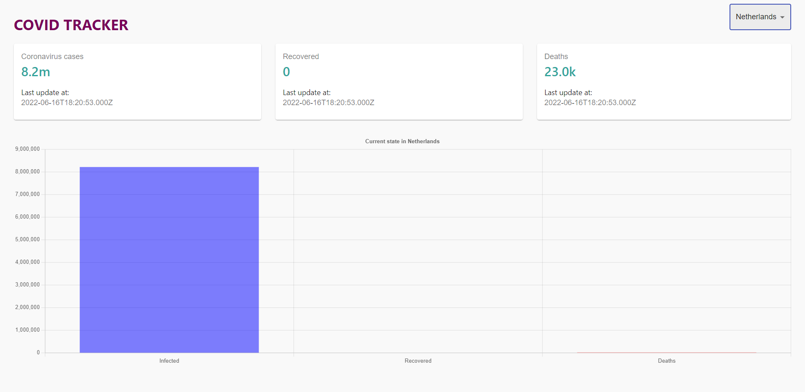

This project was bootstrapped with [Create React App](https://github.com/facebook/create-react-app).

# COVID TRACKER



This COVID Tracker shows the total number of corona cases, recovered cases and number of deaths globally and by country. It also includes a line graph that shows the numbers per day globally and bar graphs for each country.

## How to run

Make sure that you have [Node.js](https://nodejs.org/en/) installed. In the project directory, you can run:

```console
npm install --force
npm start
```

This runs the app in the development mode.\
Open [http://localhost:3000](http://localhost:3000) to view it in the browser.\
\
To run tests:

```console
npm run test
```

You can see the results in the terminal.
